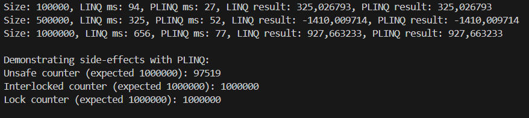

# Самостійна робота No12
## Тема: PLINQ: дослідження продуктивності та безпеки.
## Мета: Дослідити переваги та недоліки PLINQ (Parallel LINQ) у порівнянні зі звичайним LINQ, виміряти його продуктивність на різних обсягах даних та проаналізувати потенційні проблеми безпеки при паралельній обробці.

Завдання
1. Було створено новий консольний проєкт IndependentWork12.
2. За допомгою рандомної генерації було створено та заповнено велику колекцію даних.
3. Було придумано та реалізувати обчислювально інтенсивну операцію HeavyOperation. Вона дає достатнє навантаження для затримки в 2-3 секунди з великими обсягами даних.
4. Було порівняно продуктивність LINQ та PLINQ:
• Виконано одну й ту ж операцію над колекцією
• Виміряно час виконання обох підходів за допомогою System.Diagnostics.Stopwatch.
• Проведено експерименти з різними розмірами колекції: 100тис, 500тис, 1м
• Було виведено результати, а саме час виконання,  в консоль.

Вивід:

5.Було досліджено потенційні проблеми безпеки:
Створено сценарій, де PLINQ може призвести до некоректних результатів через побічні
ефекти.
Використовувалась паралельна обробка з PLINQ, під час якої збільшувався спільний лічильник. Результат виявився неправильним, Через те, що багато потоків змінювали одну змінну одночасно, частина операцій накладалася одна на одну, і результат був неправильним. Потім той самий експеримент було повторено з Interlocked і lock, і результат став правильним.

PLINQ показав себе краще з різзними обсягами даних, але має в собі слабкі місця, перевірені в експерементах. При звичайних умовах краще використовувати PLINQ задля швидкості але бути акуратним, щоб не створювати накладаннь.

