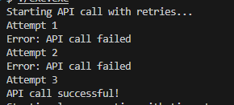
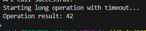

# Самостійна робота №11
## Тема: Кейси Polly/Retry: короткий звіт.
## Мета: Дослідити та проаналізувати реальні сценарії використання бібліотеки Polly для реалізації політик відмовостійкості (Retry, Circuit Breaker, Timeout) у .NET-застосунках.

1. Було створено новий консольний проєкт IndependentWork11.
В ному реалізовано 2 гіпотетичні сценарії, де було використано та продемонстровано такі ж можливості, як і в Polly, за допомогою створених функцій.

### Опис сценарію 1
Проблема: HTTP-API часом повертає помилки. Необхідно повторити запит кілька разів.
Обрана політика: Retry - для повторних запитів до гіпотетичного API повторити спробу кілька разів, з проміжками між запитом, є найкращим варіантом.

в коді реалзовано функцію CallAPI, в якій місяться: спроби, та помилка, яку виводимо після спроб. в Main реалізовано уявне звертання до API, та вивід помилки/успіху при звертанні

Скріншот виводу:

### Oпис сценарію 2
Проблема: Операція інколи виконується занадто довго, через що її потрібно зупиняти
Обрана політика: Timeout policy - якщо операція виконується більше  умвоних 5 секунд, потрібно скасувати і вивести відповідну помилку.

в коді реалізував функцію longOperation яка видає очікування в 2 секунди і повертає умовний вивід програми. В Main було реалізовано вивід помилок або успіху через порівняння часу. 

Скріншот виводу: 

