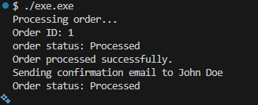

# Лабораторна робота No20
## Тема: SRP: декомпозиція OrderProcessor.
## Мета: Застосувати принцип єдиної відповідальності (SRP) для декомпозиції складного класу OrderProcessor на менші, більш сфокусовані компоненти.

### 1. Створити новий консольний проєкт lab20.
успішно виконано та створено 3 файли: код до рефакторингу, код після та README.MD

### 2. Реалізувати початковий клас OrderProcessor (порушує SRP):
• Створено клас Order (Id, CustomerName, TotalAmount, Status).
• Створено клас OrderProcessor з методом ProcessOrder(Order order). 
Цей метод імітує:
– Валідацію замовлення.
– Збереження замовлення в “базу даних”.
– Відправку email-сповіщення клієнту.
– Оновлення статусу замовлення та демонстрацію.

вивід в консолі:

### 3. Виконати рефакторинг OrderProcessor для дотримання SRP:
Після рефакторингу код був змінений для 
Розбийте функціональність OrderProcessor на окремі інтерфейси та їхні реалізації:
– IOrderValidator: Метод bool IsValid(Order order).
– IOrderRepository: Методи void Save(Order order), Order GetById(int id).
– IEmailService: Метод void SendOrderConfirmation(Order order).
– OrderService: Новий клас, який буде координувати роботу цих компонентів. Він
повинен приймати залежності через конструктор (Dependency Injection).
• Реалізуйте прості “заглушки” (mock implementations) для інтерфейсів (наприклад,
InMemoryOrderRepository, ConsoleEmailService).