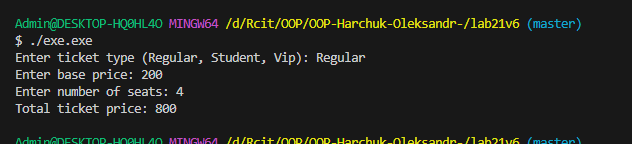

# Лабораторна робота No21
## Тема: OCP: гнучкі алгоритми розрахунку (Factory/Strategy).
## Мета: Застосувати принцип відкритості/закритості (OCP) для створення гнучкої системи розрахунків за допомогою патернів Factory Method та Strategy, забезпечивши можливість легкого додавання нових алгоритмів без зміни існуючого коду.

### 1. Створити новий консольний проєкт lab21.
виконано успішно

### 2. Реалізувати систему розрахунку вартості  з дотриманням OCP:

Реалізовано інтерфейс ITicketStrategy в якому створено метод calculatePrice

Далі створені 4 реалізації(3 раніше і одна для тесту розширень): Regular, Student, Vip,  Nightmare з своїми підрахунками 

Після чого був реалізований клас TicketStrategyFactory та статичний метод, що дозволяє повертати відповідну стратегію на основі рядка, введеного користувачем. 

Далі реалізовано клас CinemaService, що не залежить від конкретних класів стратегій, тільки від інтерфейсу.

### 3 Продемонструвати роботу в методі Main:

В мейні продемонстровано роботу коду, обробку вибору користувача та базові обрахунки та вивід в консоль.

вивід з консолі: 

