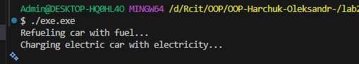

# Лабораторна робота N22

## Тема: LSP: виявлення порушень і альтернативи.

## Мета: Поглибити розуміння принципу підстановки Лісков (LSP), навчитися ідентифікувати його порушення в ієрархіях класів та застосовувати альтернативні підходи (композиція, зміна ієрархії) для створення LSP-сумісних рішень.

### Завдання

### 1. Створити новий консольний проєкт lab22.

Успішно виконано

### 2. Реалізувати початкову ієрархію класів, яка порушує LSP.

Був реалізований базовий клас: Vehicle з методом Refuel(). Від нього наслідується  похудний клас Car() та ElectricCar().

 Основним порушенням LSP в цьому завданні є те, що Електромобіль не заправляється пальним, він заряджається. Метод Refuel() стає некоректним або безглуздим. Клієнтський код очікує, що будь-який Vehicle можна заправити, хоча в нашому випадку це так не працює, тому і виникає порушення принципу підстановки Лісков.

### 4. Запропонувати та реалізувати альтернативне рішення, що дотримується LSP.

У реалізації використано два окремі інтерфейси: refuelable, який описує можливість заправки пальним, та Ichargeable, що визначає можливість заряджання електроенергією.

Клас car реалізує інтерфейс refuelable, оскільки може коректно виконувати операцію заправки, а клас ElectricCar реалізує інтерфейс Ichargeable, оскільки підтримує заряджання.

Таким чином, кожен клас реалізує лише той контракт, який може виконати без порушення логіки, що забезпечує взаємозамінність об’єктів базових типів у клієнтському коді та дотримання принципу підстановки Лісков.

### 5. Вивід з консолі

### 6. UML діграма

На діаграмі продемонстровано основні зв'язки, інтерфейси та класи, що були реалізовані в GoodReFuel.cpp. Діаграма була додана до папки lab22v6.