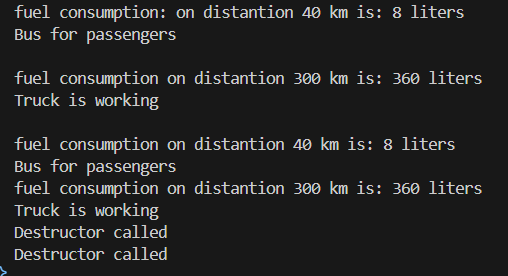

# OOP
Лабораторна робота №3
Тема: Наслідування: основи
Мета: закріпити знання про базові класи, похідні класи, модифікатори доступу, використання base, поліморфізм у простій формі.

Був створений загальний класс Vehicle().
В public додано:
    конструктор з параметрами(double fuel, double distance)
    Get і Set для fuel та distance
    абстрактний метод  fuel_consumption_calc() без логіки(реалізації всередині)
    virtual метод info() з реалізацією, яку піізніше було переписано
    Деструктор, з виводом(для демонстрації його роботи)

В protected додано:
    double m_fuel;
    double m_distance;

Було створено 2 дочірні класи: Bus і Truck
В них було реалізовано конструктори,
Був перевизначений(override) абстрактний метод fuel_consumption_calc()
Був перевизначений віртуальний метод info()

В Main(): Було створено 2 об'єкти дочірніх класів, перевірено роботу методів та деструктора

Також показана робота поліморфізму (список/масив базового типу з викликом методів похідних).

Приклад виводу:

