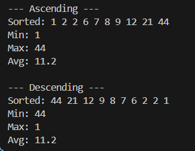

# OOP
Лабораторна робота №4
Тема: Абстракції та інтерфейси. Композиція та агрегація.

Мета: навчитися створювати абстрактні класи та інтерфейси, будувати ієрархії класів із використанням композиції та агрегації, реалізовувати прості обчислення, демонструвати гнучкість і повторне використання коду.

Був створений інтерфейс ISortStrategy
    в ньому написаний віртуальний метод Sort для сортування масиву.

Було створено 2 класи AscendingSort і DescendingSort, де був наслідуваний інтерфейс ISortStrategy. 
    В AscendingSort було реалізовано Sort за зростанням;
    В DescendingSort було реалізовано Sort за спаданням;

Наступним був реалізовний клас  NumberProcessor:
    В private:
        Посилання на ISortStrategy.
    В Public:
        Створений конструктор, через яикй передавася масив(вектор) для майбутнього сортування
        Функція process в якій:
            коректний вивід відсортованого масиву за допомогою циклу for з виводом кожного елементу;
            найменший елемент цього масиву за допомгою .front();
            найбільший елемент цього масиву за допомогою .end();
            середнє значення масиву через підрахунок середнього значення;
            А Також коректний вивід.

В main було первірено, чи коректно працює код, вивід та сортування на  прикладі вже оголошеного вектору arr

вивід:

