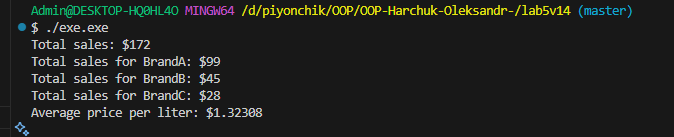

# OOP
Лабораторна робота №5
Тема: Узагальнені типи (Generics), колекції і LINQ, обробка винятків.
Мета: Навчитися створювати узагальнені класи/методи, працювати з колекціями та LINQ, коректно валідувати вхідні дані і створювати/обробляти винятки.

було створено class InvalidSaleException для відстежуння винятків, їх обробку та вивід відповідної помилки

Далі, в класі Sale було оголошено основні змінні: brand, liters та pricePerLiter. В конструкторі цього класу реалізована валідація: якщо літри або ціна за літр є нульовими чи від'ємними, програма кидає виняток InvalidSaleException з відповідним повідомленням. Також в класі реалізовано метод total(), що рахує загальну вартість конкретного продажу.

Використання template<typename T> слугувало для створення узагальненого (generic) класу Repository. Цей клас працює як сховище об'єктів типу T (в нашому випадку Sale), зберігаючи їх у std::vector. В ньому реалізовані основні методи для роботи з колекцією:
    addSale (додає новий продаж), 
    totalSales (рахує загальну суму всіх продажів), 
    totalSalesByBrand (рахує суму по конкретному бренду)
    averagePricePerLiter (обчислює середню ціну за літр по всім операціям, з перевіркою ділення на нуль).

був реалізований клас FuelPump. 
Цей клас використовує композицію, бо він містить у собі Repository<Sale>. FuelPump надає публічний інтерфейс для роботи з АЗС: метод recordSale створює об'єкт Sale і додає його до salesManager.
Методи getTotalSales, getTotalSalesByBrand та getAveragePricePerLiter просто викликають відповідні методи з salesManager.

Вивід:

Відповіді на контрольні питання:
1. Що таке generics? Які їхні переваги?
Generics — це узагальнені типи, які дозволяють створювати класи, методи або колекції, що працюють із будь-яким типом даних. Їхня перевага полягає в тому, що вони забезпечують типову безпеку, усувають потребу в приведенні типів і підвищують продуктивність та зручність коду.

2. Які основні відмінності між ArrayList і List<T>?
ArrayList зберігає елементи як об’єкти, тому втрачається типова безпека, List<T> є узагальненою колекцією і зберігає елементи певного типу. 

3. Чим відрізняється Dictionary<TKey, TValue> від List<T>?
List<T> — це послідовна колекція елементів одного типу, тоді як Dictionary<TKey, TValue> — це набір пар “ключ-значення”. У Dictionary доступ до даних здійснюється за ключем, що забезпечує швидший пошук порівняно з List.

4. У чому перевага LINQ над класичними циклами?
LINQ дозволяє працювати з даними у зручній і зрозумілій формі, скорочуючи код а також спрощує фільтрацію, сортування, групування та обробку колекцій без необхідності писати складні цикли.

5. Як працює ключове слово finally?
Блок finally виконується після виконання блоків try і catch незалежно від того, чи виникла помилка. Його використовують для завершення дій, таких як звільнення ресурсів або закриття файлів і з’єднань.

6. Коли доцільно створювати власні класи винятків?
Власні класи винятків створюють тоді, коли потрібно обробити специфічні ситуації або помилки, яких не охоплюють стандартні винятки. Це дозволяє точніше описати проблему і покращує зрозумілість обробки помилок у програмі.
