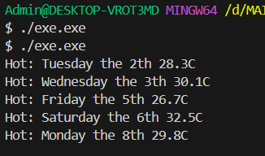

# Лабораторна робота №6

## Тема: Лямбда-вирази, анонімні функції та делегати у C#

Був створений класс TemperatureRecord. В ньому реалізований конструктор з day, date, temperature
в main була створена колекція, що містить в собі 8 днів з різними темпераатурами

була реалізована лямбдла функція IsHot для перевірки чи температура не перевищує 25 

також була реалізована лямбда функція showTemp для красивого виводу температур.

далі через цикл було виведено всі дні, які потрапили під фільтр лямбди IsHot

## Приклад запуску

