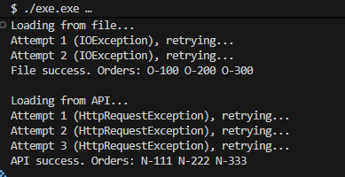

# Лабораторна робота №7
## Тема: Обробка IO/мережевих помилок та патерн Retry.
## Мета: Навчитися обробляти типові помилки вводу/виводу та мережеві помилки за допомогою блоків try-catch-finally, а також реалізувати патерн Retry для підвищення відмовостійкості застосунків.

Було створено класс FileProcessor. Який у перші 2 спроби кидає виняток std::ios_base::failure (імітація помилки читання файлу), при нормі відправляє умовну інформацію з файлу. 

Було створено класс NetworkClient  який у перші 3 спроби кидає виняток std::runtime_error (імітація помилки мережевого запиту) при нормі відправляє умовну інформацію з апі

Було реалізовано класс RetryHelper. містить в собі темплейт  Execute, що приймає на вхід функцію, std::function<bool(const std::exception&)> shouldRetry та максимальну кількість спроб.
за допомогою циклу for та try - catch відбуваються спроби, при успіху повертає значення з функції.

в Main реалізований вивід спроб зі сценаріями тимчасових помилок та використання shouldRetry для вибіркової обробки винятків, повідомлення про помилки та успіх при завершенні.

приклад виводу:

